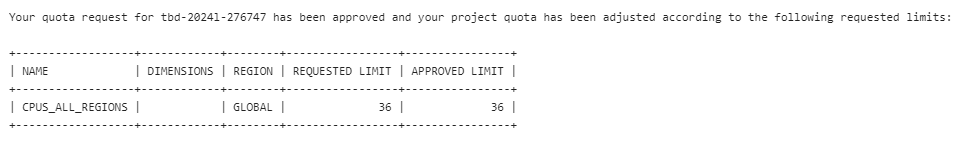
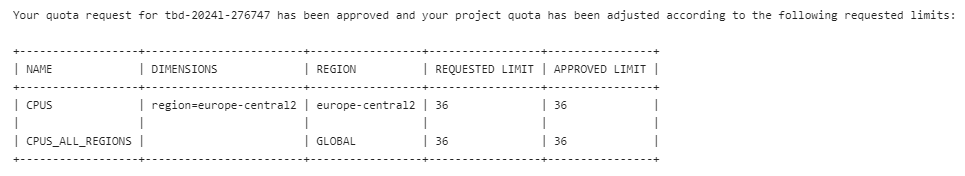
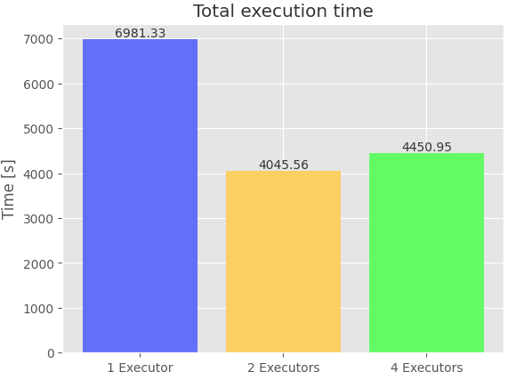
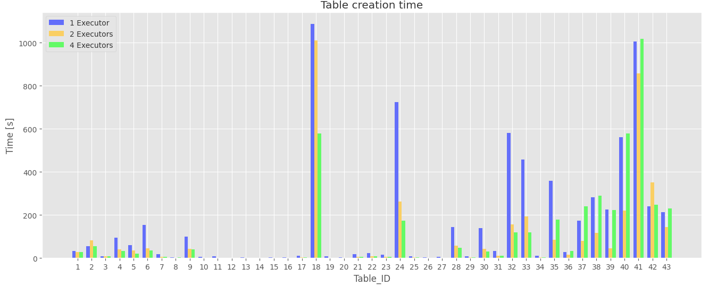

0. The goal of phase 2b is to perform benchmarking/scalability tests of sample three-tier lakehouse solution.

1. In main.tf, change machine_type at:

```
module "dataproc" {
  depends_on   = [module.vpc]
  source       = "github.com/bdg-tbd/tbd-workshop-1.git?ref=v1.0.36/modules/dataproc"
  project_name = var.project_name
  region       = var.region
  subnet       = module.vpc.subnets[local.notebook_subnet_id].id
  machine_type = "e2-standard-2"
}
```


and subsititute "e2-standard-2" with "e2-standard-4".

2. If needed request to increase cpu quotas (e.g. to 30 CPUs): 
https://console.cloud.google.com/apis/api/compute.googleapis.com/quotas?project=tbd-2023z-9918





3. Using tbd-tpc-di notebook perform dbt run with different number of executors, i.e., 1, 2, and 5, by changing:
```
 "spark.executor.instances": "2"
```

in profiles.yml.

4. In the notebook, collect console output from dbt run, then parse it and retrieve total execution time and execution times of processing each model. Save the results from each number of executors. 

5. Analyze the performance and scalability of execution times of each model. Visualize and discucss the final results.

Całkowity czas wykonania dla różnych wartości parametru *spark.executor.instances*:

- 1: 116 min 21 s
- 2: 67 min 25 s
- 4: 74 min 10 s

 

Zadanie zajęło najmniej czasu w przypadku wartości parametru *spark.executor.instances* = 2. Przy zmianie z 1 na 2 executorów, czas wykonania znacznie się skrócił o 42,05%. Jednak gdy liczba executorów wzrosła z 2 do 4, czas wykonania nieznacznie wzrósł (dokładnie o 10,02%), co sugeruje, że dodatkowe executory nie były efektywnie wykorzystywane, prawdopodobnie z powodu rywalizacji o zasoby.

Wykres poniżej przedstawia czas tworzenia kolejnych tabel w przypadku różnej liczby executorów. 

 

W tabeli poniżej znajdują się identyfikatory tabel oraz ich pełne nazwy.

| Table_ID | Nazwa tabeli |
| :----: | :----: |
| 1 | demo_bronze.brokerage_cash_transaction |
| 2 | demo_bronze.brokerage_daily_market |
| 3 | demo_bronze.brokerage_holding_history |
| 4 | demo_bronze.brokerage_trade |
| 5 | demo_bronze.brokerage_trade_history |
| 6 | demo_bronze.brokerage_watch_history |
| 7 | demo_bronze.crm_customer_mgmt |
| 8 | demo_bronze.finwire_company |
| 9 | demo_bronze.finwire_financial |
| 10 | demo_bronze.finwire_security |
| 11 | demo_bronze.hr_employee |
| 12 | demo_bronze.reference_date |
| 13 | demo_bronze.reference_industry |
| 14 | demo_bronze.reference_status_type |
| 15 | demo_bronze.reference_tax_rate |
| 16 | demo_bronze.reference_trade_type |
| 17 | demo_bronze.syndicated_prospect |
| 18 | demo_silver.daily_market |
| 19 | demo_silver.employees |
| 20 | demo_silver.date |
| 21 | demo_silver.companies |
| 22 | demo_silver.accounts |
| 23 | demo_silver.customers |
| 24 | demo_silver.trades_history |
| 25 | demo_gold.dim_broker |
| 26 | demo_gold.dim_date |
| 27 | demo_gold.dim_company |
| 28 | demo_silver.financials |
| 29 | demo_silver.securities |
| 30 | demo_silver.cash_transactions |
| 31 | demo_gold.dim_customer |
| 32 | demo_gold.dim_trade |
| 33 | demo_silver.trades |
| 34 | demo_gold.dim_security |
| 35 | demo_silver.watches_history |
| 36 | demo_gold.dim_account |
| 37 | demo_silver.holdings_history |
| 38 | demo_silver.watches |
| 39 | demo_gold.fact_cash_transactions |
| 40 | demo_gold.fact_trade |
| 41 | demo_gold.fact_holdings |
| 42 | demo_gold.fact_watches |
| 43 | demo_gold.fact_cash_balances |

Dla tabel z dłuższymi czasami tworzenia (np. demo_silver.watches, demo_gold.fact_trade), które tworzone były pod koniec procesu, redukcja całkowitego czasu wykonania jest znacząca przy przejściu z 1 do 2 executorów. Jednak po zwiększeniu liczby executorów do 4 dla dużych tabel nie widać znaczącej poprawy, co może sugerować, że osiągnięto optymalną wydajność przy 2 executorach. W niektórych przypadkach (np. demo_gold.fact_trade, demo_gold.fact_holdings) widać nawet pogorszenie wydajności. Dodanie większej liczby executorów po pewnym momencie nie zawsze powoduje zwiększenie wydajności. Warto monitorować zasoby, aby upewnić się, że dodanie większej liczby executorów rzeczywiście wykorzystuje dostępne zasoby.
   
