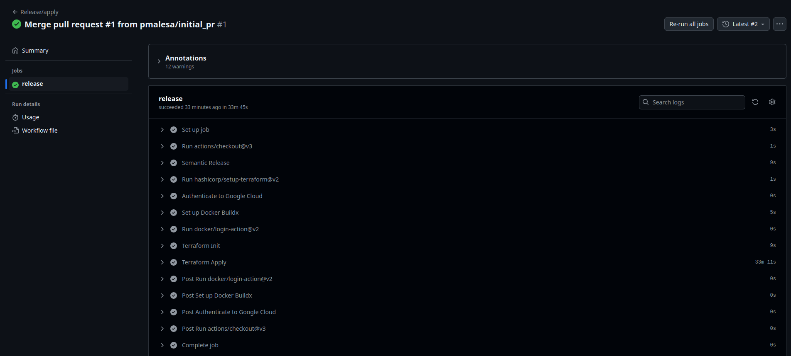
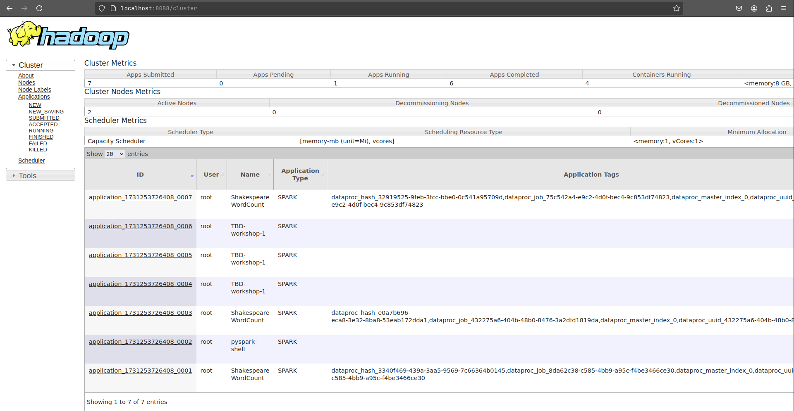
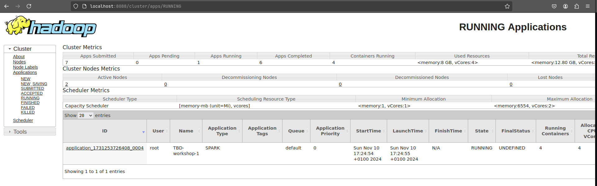
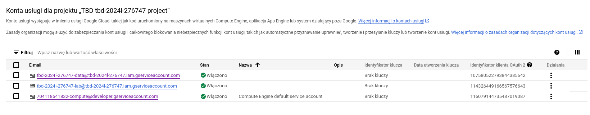
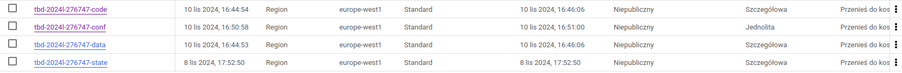
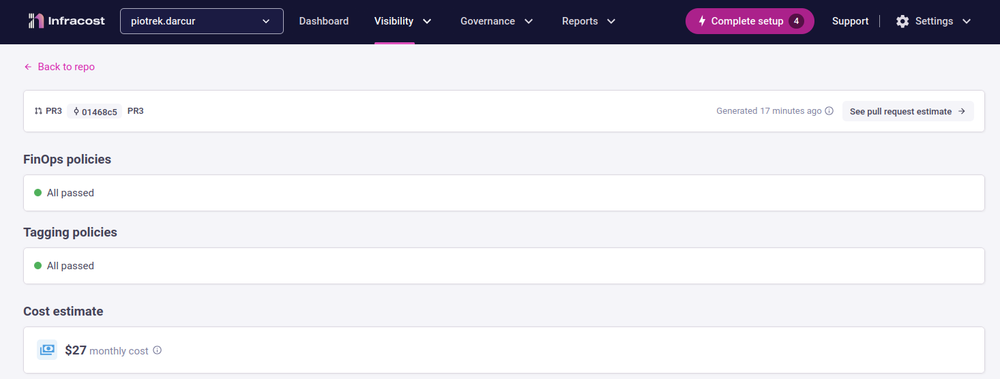

IMPORTANT ❗ ❗ ❗ Please remember to destroy all the resources after each work session. You can recreate infrastructure by creating new PR and merging it to master.
  


1. Authors:

   ***Z10***

   ***https://github.com/pmalesa/tbd-workshop-1***
   
2. Follow all steps in README.md.

3. Select your project and set budget alerts on 5%, 25%, 50%, 80% of 50$ (in cloud console -> billing -> budget & alerts -> create buget; unclick discounts and promotions&others while creating budget).

5. From avaialble Github Actions select and run destroy on main branch.

    
   
6. Create new git branch and:
    1. Modify tasks-phase1.md file.
    
    2. Create PR from this branch to **YOUR** master and merge it to make new release. 
    
    

7. Analyze terraform code. Play with terraform plan, terraform graph to investigate different modules.

    Selected module: Dataproc

    Dataproc is a fully managed and highly scalable service for running Apache Hadoop, Apache Spark, Apache Flink, Presto and more than 30 open source tools and frameworks. Dataproc can be used to modernize data lakes, ETL and secure data science, at scale, integrated with Google Cloud.

    Output for cluster_module.dataproc:

    ```
    subgraph "cluster_module.dataproc" {
    label = "module.dataproc"
    fontname = "sans-serif"
    "module.dataproc.google_dataproc_cluster.tbd-dataproc-cluster" [label="google_dataproc_cluster.tbd-dataproc-cluster"];
    "module.dataproc.google_project_service.dataproc" [label="google_project_service.dataproc"];
    }

    "module.composer.module.composer.google_composer_environment.composer_env" -> "module.dataproc.google_dataproc_cluster.tbd-dataproc-cluster";
    "module.dataproc.google_dataproc_cluster.tbd-dataproc-cluster" -> "module.dataproc.google_project_service.dataproc";
    "module.dataproc.google_dataproc_cluster.tbd-dataproc-cluster" -> "module.dataproc.google_project_service.dataproc";
    "module.dataproc.google_project_service.dataproc" -> "module.vpc.google_compute_firewall.default-internal-allow-all";
    "module.dataproc.google_project_service.dataproc" -> "module.vpc.google_compute_firewall.fw-allow-ingress-from-iap";
    "module.dataproc.google_project_service.dataproc" -> "module.vpc.module.cloud-router.google_compute_router_nat.nats";
    "module.dataproc.google_project_service.dataproc" -> "module.vpc.module.vpc.module.firewall_rules.google_compute_firewall.rules";
    "module.dataproc.google_project_service.dataproc" -> "module.vpc.module.vpc.module.firewall_rules.google_compute_firewall.rules_ingress_egress";
    "module.dataproc.google_project_service.dataproc" -> "module.vpc.module.vpc.module.routes.google_compute_route.route";
    "module.dataproc.google_project_service.dataproc" -> "module.vpc.module.vpc.module.vpc.google_compute_shared_vpc_host_project.shared_vpc_host";
    ```
   
8. Reach YARN UI
   
   ***place the command you used for setting up the tunnel, the port and the screenshot of YARN UI here***

   
   
   
9. Draw an architecture diagram (e.g. in draw.io) that includes:
    1. VPC topology with service assignment to subnets

    // TODO

    2. Description of the components of service accounts

    704118541832-compute@developer.gserviceaccount.com (Service Account Token Creator):
    It is used to impersonate service accounts (create OAuth2 access tokens, sign blobs or JWTs, etc). 

    tbd-2024l-276747-data@tbd-2024l-276747.iam.gserviceaccount.com:
    Provides the permissions necessary for viewing the resources required to manage Dataproc, including machine types, networks, projects, and zones. It also provides the permissions necessary to list and get Cloud Composer environments and operations. Provides read-only access to objects in all project buckets. 

    tbd-2024l-276747-lab@tbd-2024l-276747.iam.gserviceaccount.com: 


    

    3. List of buckets for disposal

    


    4. Description of network communication (ports, why it is necessary to specify the host for the driver) of Apache Spark running from Vertex AI Workbech
  
    // TODO

    ***place your diagram here***

10. Create a new PR and add costs by entering the expected consumption into Infracost
For all the resources of type: `google_artifact_registry`, `google_storage_bucket`, `google_service_networking_connection`
create a sample usage profiles and add it to the Infracost task in CI/CD pipeline. Usage file [example](https://github.com/infracost/infracost/blob/master/infracost-usage-example.yml) 

    ```
    google_artifact_registry_repository.my_artifact_registry:
        storage_gb: 150 
        monthly_egress_data_transfer_gb: 
            europe_north1: 100 
            australia_southeast1: 200

    google_storage_bucket.my_storage_bucket:
        storage_gb: 150 
        monthly_class_a_operations: 40000 
        monthly_class_b_operations: 20000 
        monthly_data_retrieval_gb: 500   
        monthly_egress_data_transfer_gb:
            same_continent: 550 
            worldwide: 12500 
            asia: 1500
            china: 50
            australia: 250

    google_service_networking_connection.my_connection:
        monthly_egress_data_transfer_gb:
            same_region: 250
            us_or_canada: 100
            europe: 70   
            asia: 50
            south_america: 100
            oceania: 50 
            worldwide: 200 
    ```
   
   

11. Create a BigQuery dataset and an external table using SQL
    
    ***place the code and output here***
   
    ***why does ORC not require a table schema?***

  
12. Start an interactive session from Vertex AI workbench:

    ***place the screenshot of notebook here***
   
13. Find and correct the error in spark-job.py

    ***describe the cause and how to find the error***

14. Additional tasks using Terraform:

    1. Add support for arbitrary machine types and worker nodes for a Dataproc cluster and JupyterLab instance

    ***place the link to the modified file and inserted terraform code***
    
    3. Add support for preemptible/spot instances in a Dataproc cluster

    ***place the link to the modified file and inserted terraform code***
    
    3. Perform additional hardening of Jupyterlab environment, i.e. disable sudo access and enable secure boot
    
    ***place the link to the modified file and inserted terraform code***

    4. (Optional) Get access to Apache Spark WebUI

    ***place the link to the modified file and inserted terraform code***
